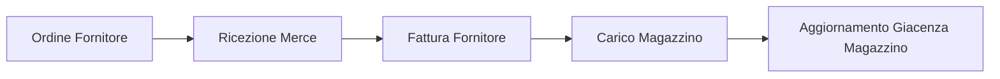
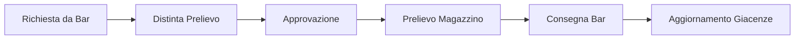
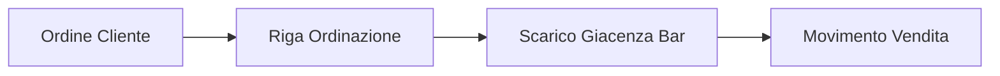

# Flusso Operativo Magazzino → Bar

## Panoramica

Il sistema gestisce separatamente le giacenze del magazzino centrale e dei punti vendita (bar, cucina, etc.) attraverso il concetto di **Ubicazioni**.

## Flusso Completo

### 1. Acquisto da Fornitore → Magazzino

**Processo:**
1. Si crea un `OrdineFornitore` con le righe prodotti
2. Alla consegna, si registra la `FatturaFornitore` con:
   - Numero fattura
   - Importi e IVA
   - Righe con quantità e prezzi
3. Il sistema crea automaticamente:
   - `MovimentoTrasferimento` di tipo `CARICO_FORNITORE`
   - Aggiornamento `GiacenzaUbicazione` del magazzino

### 2. Trasferimento Magazzino → Bar

**Processo:**
1. **Richiesta**: Il bar crea una `DistintaPrelievo` con i prodotti necessari
2. **Approvazione**: Un supervisore approva la distinta
3. **Prelievo**: Il magazziniere preleva i prodotti e aggiorna le quantità prelevate
4. **Consegna**: Il bar riceve la merce e conferma le quantità
5. **Movimenti**: Il sistema genera:
   - `MovimentoTrasferimento` di tipo `TRASFERIMENTO`
   - Scarico da `GiacenzaUbicazione` magazzino
   - Carico su `GiacenzaUbicazione` bar

### 3. Vendita dal Bar

**Processo:**
1. Quando si crea una `RigaOrdinazione` per un cliente
2. Il sistema verifica la disponibilità nella `GiacenzaUbicazione` del bar
3. Alla conferma ordine:
   - Crea `MovimentoTrasferimento` di tipo `VENDITA`
   - Scarica la `GiacenzaUbicazione` del bar

## Ubicazioni Tipiche

1. **MAGAZZINO**: Magazzino centrale
2. **BAR**: Banco bar principale
3. **CUCINA**: Dispensa cucina
4. **CANTINA**: Cantina vini
5. **DISPENSA**: Dispense secondarie

## Unità di Misura

### Magazzino (unità di acquisto)
- **Cartone**: per bibite, birre (es. 24 pezzi)
- **Cassa**: per vini (es. 6 bottiglie)
- **Fusto**: per birra alla spina (es. 30 litri)
- **Sacco**: per caffè (es. 1 kg)
- **Confezione**: per snack (es. 50 pezzi)

### Bar (unità di vendita)
- **Pezzo**: bottiglia, lattina singola
- **Bicchiere**: per vino, birra alla spina
- **Tazzina**: per caffè
- **Porzione**: per cocktail, panini

## Conversioni Automatiche

Il sistema gestisce automaticamente le conversioni:
- 1 cartone Coca Cola (24 pz) → 24 bottiglie al bar
- 1 fusto birra (30 L) → 75 birre medie (0.4L)
- 1 bottiglia gin (0.7L) → 17 cocktail (40ml per drink)

## Gestione Scorte

### Livelli di Riordino
- **Magazzino**: basato su lead time fornitori
- **Bar**: basato su consumo medio giornaliero

### Notifiche Automatiche
1. **Scorta minima magazzino**: genera suggerimento ordine fornitore
2. **Scorta minima bar**: genera suggerimento distinta prelievo
3. **Prodotto esaurito bar**: notifica immediata per rifornimento urgente

## Reportistica

### Report Magazzino
- Giacenze attuali per ubicazione
- Valore magazzino
- Prodotti sotto scorta
- Analisi rotazione

### Report Trasferimenti
- Distinte in sospeso
- Storico trasferimenti
- Differenze inventariali

### Report Consumi
- Consumi per ubicazione
- Food cost per ubicazione
- Analisi sprechi/scarti

## Vantaggi del Sistema

1. **Controllo preciso** delle giacenze per ubicazione
2. **Tracciabilità completa** dei movimenti
3. **Ottimizzazione acquisti** basata su consumi reali
4. **Riduzione sprechi** con gestione scadenze
5. **Responsabilizzazione** del personale per area
6. **Analisi profittabilità** per punto vendita

## Configurazione Iniziale

1. Definire le ubicazioni (magazzino, bar, cucina, etc.)
2. Configurare i prodotti con:
   - Unità di acquisto e pezzi per unità
   - Livelli di riordino per ubicazione
   - Fornitori preferiti
3. Inventario iniziale per ubicazione
4. Assegnare permessi utente per gestione distinte